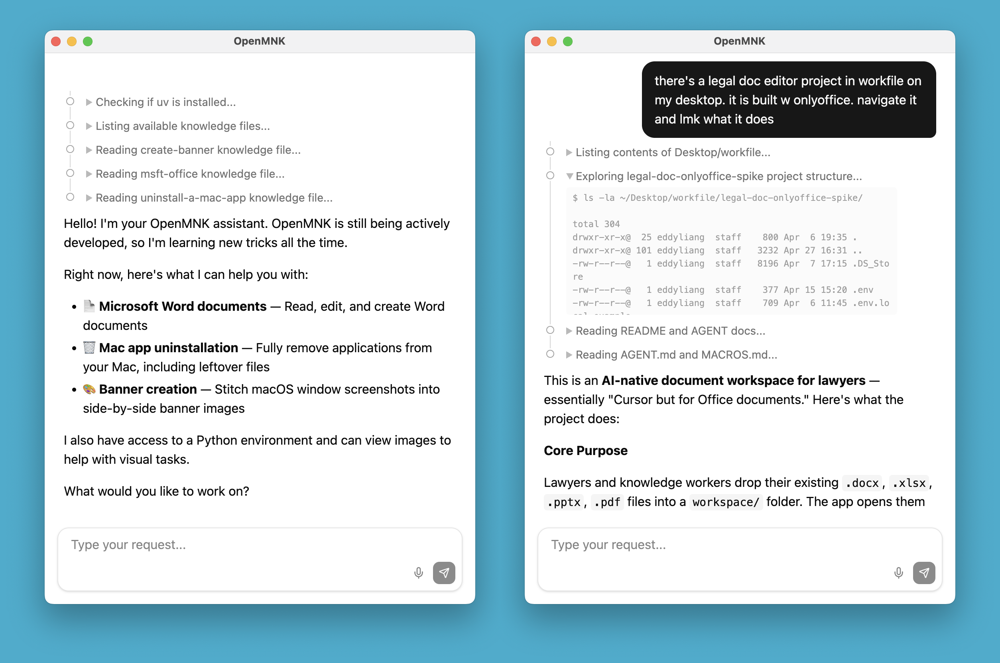

# OpenMNK



Agent that operates your computer with only a terminal.

OpenMNK intentionally has no plugin system. The only thing we load into the model context via software is its base knowledge in `base.md`. Additionally, the only tool it uses is the terminal (and `view()` to see images).

The agent does everything else itself. It checks `~/.openmnk/knowledge/` for written procedures, reads them, installs any missing dependencies, and introduces itself.

Features beyond the core agent ship as separate software. The agent learns to use them from markdown files it manages itself in the file system.

## Quick Start

```bash
cp .env.example .env
```

Add your LLM provider URL, API key, and model name in the created `.env` file. Then run

```bash
npm install && npm run dev
```


