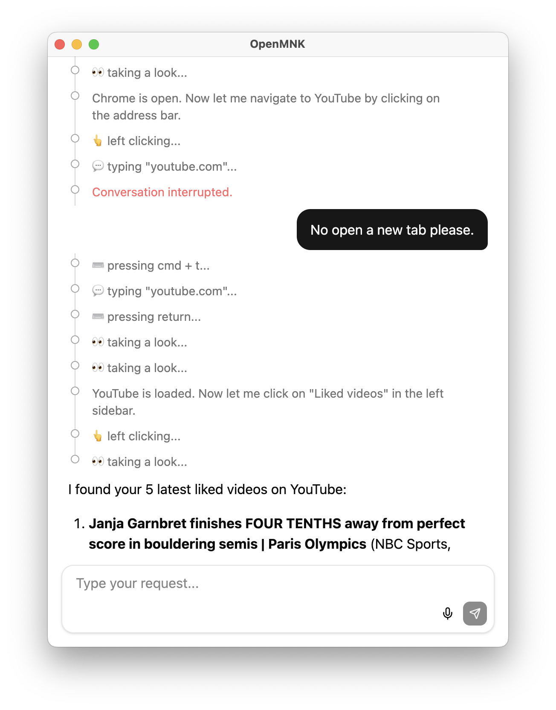

# OpenMNK

Open-source desktop tool that lets LLM see your screen and use mouse and keyboard. Plug in any OpenAI-compatible model and let it operate your computer.

<p align="center"></p>

### Quickstart

```bash
git clone https://github.com/Emericen/openmnk.git
cd openmnk
cp .env.example .env         # add your API key
npm install
npm run dev
```

### Configuration

Edit `.env` with your LLM provider:

```bash
# Any OpenAI-compatible API
LLM_BASE_URL=https://api.fireworks.ai/inference/v1
LLM_MODEL=accounts/fireworks/models/kimi-k2p5
LLM_API_KEY=your-api-key-here

# Voice transcription (optional but very useful)
TRANSCRIBE_BASE_URL=https://audio-turbo.api.fireworks.ai/v1
TRANSCRIBE_MODEL=whisper-v3-turbo
TRANSCRIBE_API_KEY=your-api-key-here

# Trigger Hotkey (recommend `alt` on macOS and `control_right` on Windows)
TRIGGER_KEY=alt
```

I recommend [Fireworks AI](https://fireworks.ai/) for their low cost and latency on strong models like Kimi K2.5. But you can use any provider with an OpenAI-compatible endpoint.

### How to use

Everything is driven by one key — your trigger key.

1. Tap `Trigger` key to surface the chat when in overlay mode.
2. Optionally, hold `Trigger` key to dictate your query.
3. Press `Enter` to submit your query.
   1. Tap `Trigger` key to approve each action. 
   2. Tap `Escape` key to stop and tell agent to do something different.
   3. Work until task is done.

<p align="center"></p>

That's it. One key to talk, one key to approve. You can operate your computer with one hand.

### How it works

The agent takes a screenshot, sends it to an LLM with your request, and receives back tool calls. Tools available to the agent:

| Tool | Description |
| --- | --- |
| `screenshot` | Capture current screen state (auto-approved) |
| `left_click` `right_click` `double_click` | Click at a screen coordinate |
| `type_text` | Type text at cursor position |
| `keyboard_hotkey` | Press key combinations (e.g. cmd+c) |
| `scroll_up` `scroll_down` | Scroll in a direction |
| `drag` | Click and drag between two points |
| `page_up` `page_down` | Page navigation |

After each action, it may decide to take another screenshot and continue or stop and respond to you if it thinks task is complete.

**A note on resolution:** Screenshots are resized to 720p height before being sent to the model. On laptops this typically works well since text stays readable at that resolution. On large high-resolution external monitors (4K+), text may appear small in the resized screenshot and the model may struggle with precision. If you experience this, try lowering your display resolution or increasing your OS text scaling.

### Requirements

- Node.js 18+
- macOS or Windows
- Accessibility permissions (macOS) for mouse/keyboard control

### Tech stack

Electron, React, TypeScript, Tailwind CSS. Desktop automation via [nut-js](https://github.com/nut-tree/nut.js). Global hotkeys via [iohook-macos](https://github.com/nicedayyy/iohook-macos) and [@tkomde/iohook](https://github.com/tkomde/iohook) (Windows).

### Contributing

```bash
npm run check    # typecheck + lint + format + tests
npm run dev      # development mode with hot reload
```

### License

[Apache-2.0](LICENSE)
