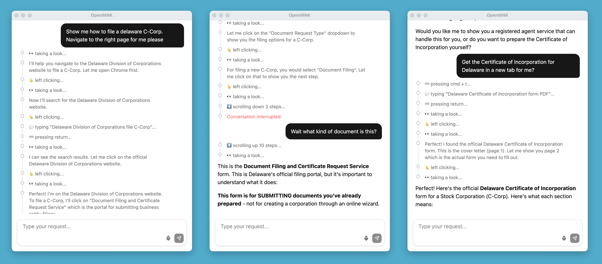

# OpenMNK

<p align="center"></p>

Open-source AI desktop agent that sees your screen and controls your mouse and keyboard. Operate your computer with one hand. Works with any OpenAI-compatible API.

### Quickstart

```bash
git clone https://github.com/nicedayyy/openmnk.git
cd openmnk
cp .env.example .env         # add your API key
npm install
npm run dev
```

### Configuration

Edit `.env` with your LLM provider:

```bash
# Any OpenAI-compatible API
LLM_BASE_URL=https://api.fireworks.ai/inference/v1
LLM_MODEL=accounts/fireworks/models/kimi-k2p5
LLM_API_KEY=your-api-key-here

# Voice transcription (optional)
TRANSCRIBE_BASE_URL=https://audio-turbo.api.fireworks.ai/v1
TRANSCRIBE_MODEL=whisper-v3-turbo
TRANSCRIBE_API_KEY=your-api-key-here

# Trigger Hotkey (recommend `alt` on macOS and `control_right` on Windows)
TRIGGER_KEY=alt
```

I recommend [Fireworks AI](https://fireworks.ai/) for their low cost and latency on strong models like Kimi K2.5. But you can use any provider with an OpenAI-compatible endpoint.

### How to use

Everything is driven by one key — your trigger key.

1. **Tap** the trigger key to open the chat window
2. (Optional) **Hold** the trigger key to dictate your request by voice
3. The agent sees your screen, plans, and proposes actions
4. **Tap** the trigger key to approve each action, or **Escape** to reject
5. Repeat — the agent keeps going until the task is done

That's it. One key to talk, one key to approve. Your other hand stays free.

| Shortcut | Action |
| --- | --- |
| Trigger tap | Open chat / approve action |
| Hold trigger | Push-to-talk dictation |
| Escape | Reject action / cancel query |

### How it works

The agent takes a screenshot, sends it to an LLM with your request, and receives back tool calls — click here, type this, scroll there. Every action except screenshots requires your approval before it executes. After each action, it takes another screenshot and decides the next step.

**Tools available to the agent:**

| Tool | Description |
| --- | --- |
| `screenshot` | Capture current screen state (auto-approved) |
| `left_click` `right_click` `double_click` | Click at a screen coordinate |
| `type_text` | Type text at cursor position |
| `keyboard_hotkey` | Press key combinations (e.g. cmd+c) |
| `scroll_up` `scroll_down` | Scroll in a direction |
| `drag` | Click and drag between two points |
| `page_up` `page_down` | Page navigation |

### Requirements

- Node.js 18+
- macOS or Windows
- Accessibility permissions (macOS) for mouse/keyboard control

### Tech stack

Electron, React, TypeScript, Tailwind CSS. Desktop automation via [nut-js](https://github.com/nut-tree/nut.js). Global hotkeys via [iohook](https://github.com/nicedayyy/iohook-macos).

### Contributing

```bash
npm run check    # typecheck + lint + format + tests
npm run dev      # development mode with hot reload
```
